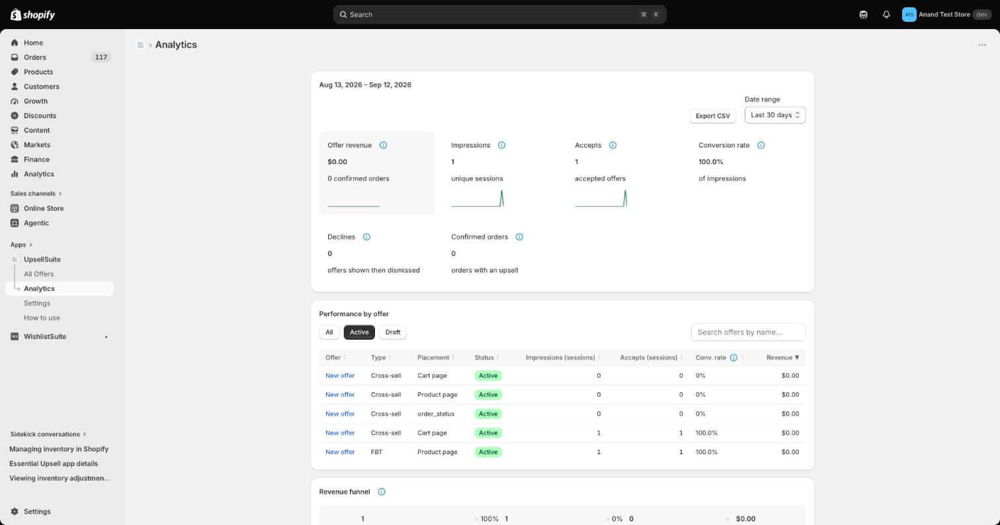
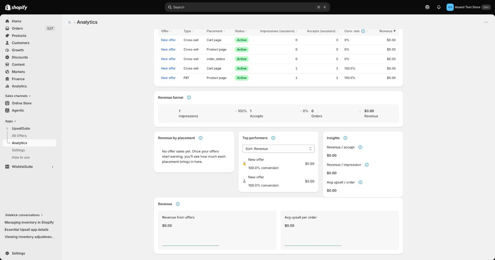

# Analytics

UpsellSuite tracks real, attributed performance for every offer — not estimates.

### What's tracked

- **Impressions** — how many times an offer was shown
- **Accepts** — how many times a shopper added the offered product
- **Declines** — offers shown then dismissed, without adding anything
- **Confirmed orders** — completed orders that included at least one upsell
- **Revenue** — attributed order revenue from accepted offers, in your store's currency
- **Conversion rate** — accepts ÷ impressions

Three of the KPIs (Offer revenue, Impressions, Accepts) show a small trend line across the selected date range. Clicking a KPI sorts the Performance by offer table below by that metric.

### Views

- **Dashboard summary** — headline KPIs for the current period, with a link into full Analytics
- **Full Analytics page** — Performance by offer table (sortable, searchable, filterable by status), a Revenue funnel (Impressions → Accepts → Orders → Revenue with stage-to-stage retention), Revenue by placement, Top performers, Insights (revenue per accept/impression, avg upsell per order), and a Revenue trend section — with CSV export

### How revenue is attributed

When an order is placed, UpsellSuite matches it back to the specific offer that drove it using a layered approach: a line-item property stamped at add-to-cart (primary signal), falling back to cart-level attributes, and finally a session-based fallback for edge cases. This keeps attribution accurate even across different checkout flows (standard cart, post-purchase, thank-you page).

### Multi-currency

Revenue is always summed in your store's base currency — presentment-currency orders are converted before being added to totals, so figures across currencies are never mixed.
