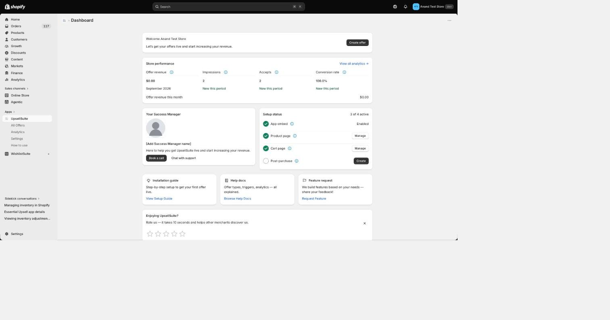

# Dashboard

The Dashboard is your home screen in UpsellSuite — a quick-glance view of setup progress and store performance.

### Getting started checklist

Tracks the three onboarding milestones: enabling the app embed, creating your first offer, and publishing your first offer. This section hides itself once you're fully set up.

### Store performance

A rolling summary of:

- **Offer revenue** — attributed revenue from all published offers this period
- **Impressions** — how many times your offers were shown
- **Accepts** — how many times a shopper added an offered product
- **Conversion rate** — accepts ÷ impressions

Click **View all analytics** to go to the full [Analytics](analytics.md) page for per-offer and per-placement breakdowns.

### Your Success Manager

A quick way to book a call or reach support directly from the Dashboard.

### Setup status

Shows the live enabled/disabled state of each surface — App embed, Product page, Cart page, and Post-purchase — with one-click **Enable**/**Manage** actions. This updates automatically when you return to the app after making a change elsewhere (like enabling the embed in the Theme Editor), without needing to refresh the page.

### Resources

Quick links to the setup guide, help docs, and a way to request a feature.
