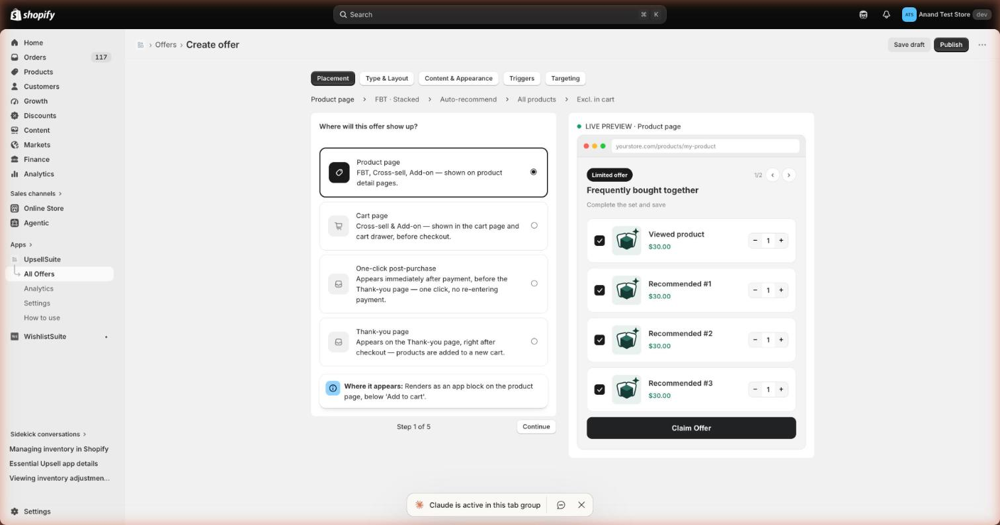
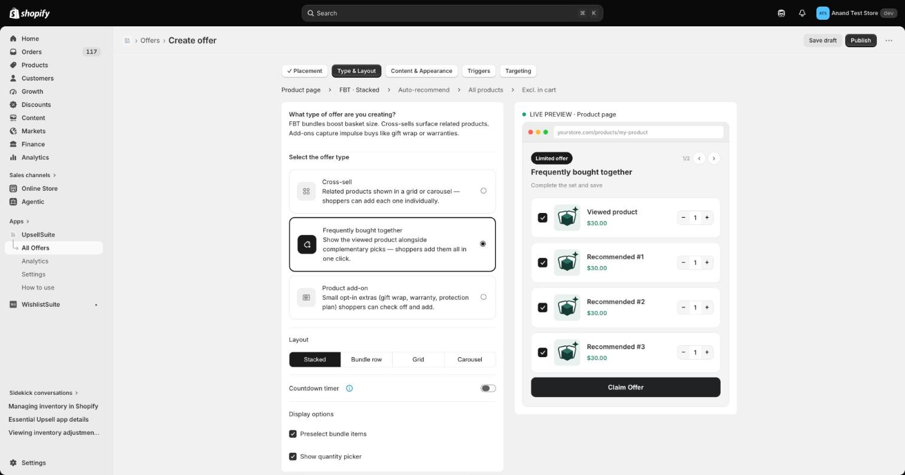
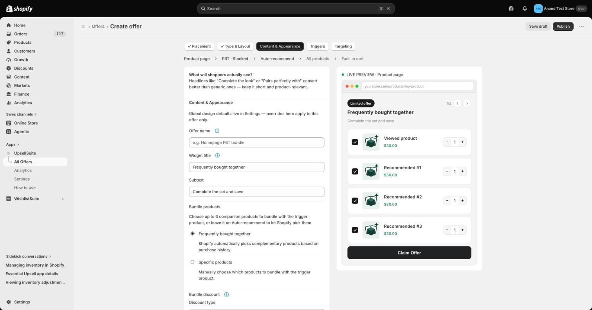
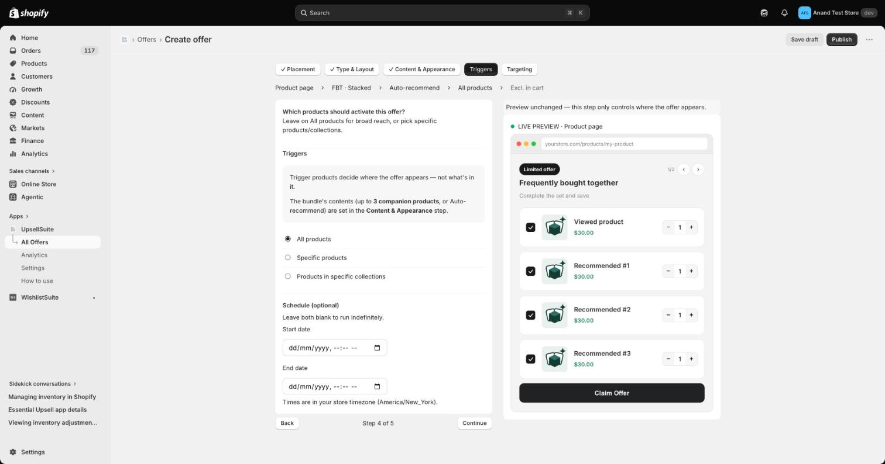
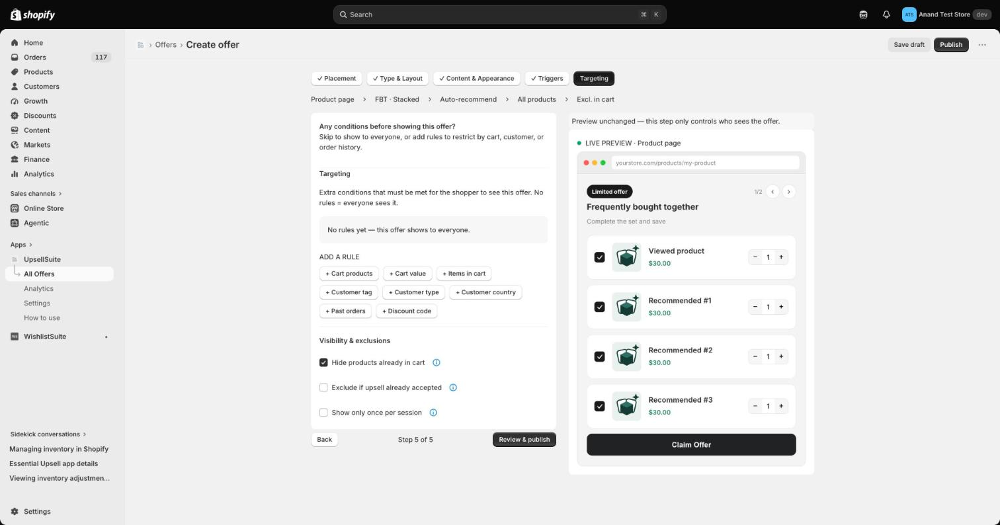

# Offer Builder

The Offer Builder is a 5-step wizard used to create every offer type in UpsellSuite. A live preview of the offer updates on the right as you go.

1. **Placement** — choose where the offer appears (Product page, Cart page, One-click post-purchase, or Thank-you page).

   

2. **Type & Layout** — pick the offer type available for that placement (Cross-sell, Frequently bought together, or Product add-on) and its layout (Stacked, Bundle row, Grid, or Carousel).

   

3. **Content & Appearance** — offer name, widget title/subtext, which products are bundled, and discount settings.

   

4. **Triggers** — which product(s)/collection(s) the offer appears on, plus optional scheduling (start/end dates).

   

5. **Targeting** — optional rules that control who sees the offer, plus visibility/exclusion options (e.g. hide products already in cart). Finish with **Review & publish**.

   

### Offer types

| Type | Available on | Guide |
|---|---|---|
| **Frequently Bought Together (FBT)** | Product page | [FBT](fbt.md) |
| **Cross-sell** | Product page, Cart page, Post-purchase, Thank-you page | [Cross-sell](cross-sell.md) |
| **Product Add-on** | Product page, Cart page | [Add-on](addon.md) |
| **Post-purchase (one-click)** | Immediately after checkout | [Post-purchase](post-purchase.md) |
| **Thank-you page** | Order status / thank-you page | [Thank-you](thank-you.md) |

Not sure which type fits your use case? Start with **Cross-sell** for general "customers also bought" style offers, **FBT** for bundling a specific companion product, and **Post-purchase** if you want an extra one-click add before the customer even reaches the order confirmation.
