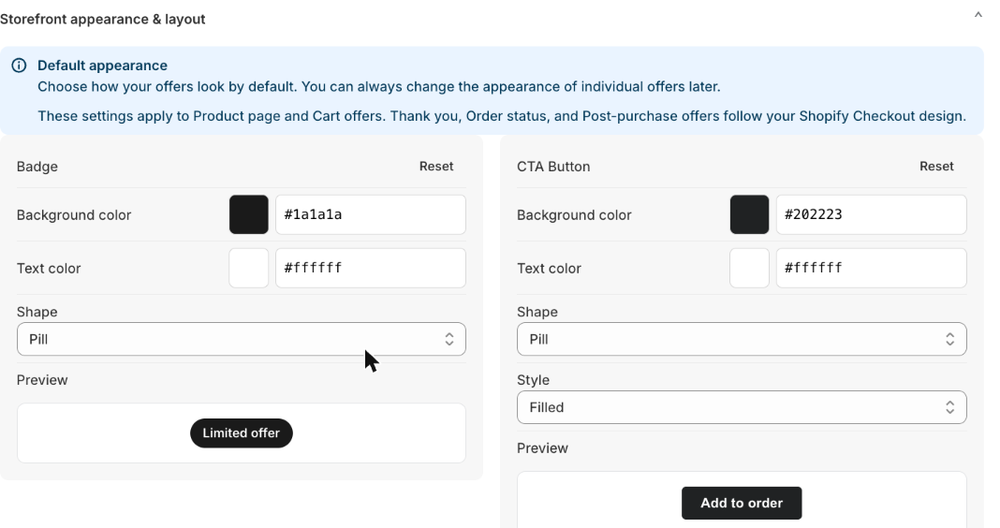
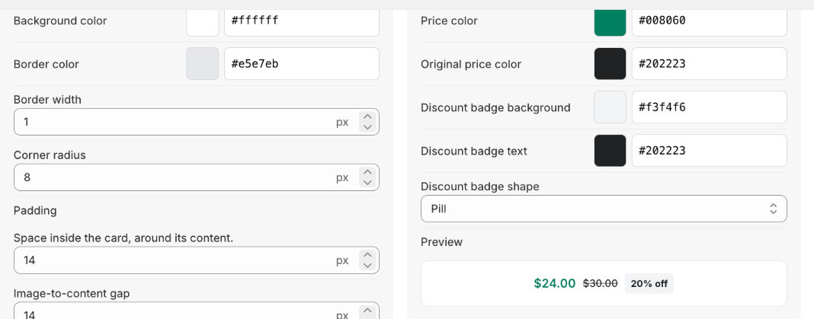
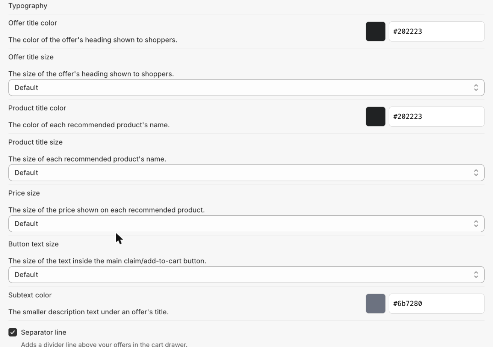

# Storefront Appearance

Set store-wide defaults for how offer widgets look. Each card has a live preview and its own **Reset** button. Per-offer color overrides (set inside the Offer Builder's design step) always take priority over these defaults.


These settings apply to **Product page** and **Cart** offers. Thank-you, Order status, and Post-purchase offers follow your Shopify Checkout design instead.


### Badge

Background color, text color, and shape (Pill, Rounded, or Square) for the "Limited offer" style badge.

### CTA Button

Background color, text color, shape, and style (Filled or Outlined) for the main action button (e.g. "Add to order").

### Product card

Background color, border color/width, corner radius, padding, and the gap between the image and content, and between stacked products.

### Pricing & discount badge

Price color, original (struck-through) price color, and the discount badge's background/text color and shape.

### Image, checkbox & quantity picker

Thumbnail size and corner radius, checkbox color, and the quantity picker's border color, radius, background, icon color, and size.

### Carousel controls

Arrow background/border/icon color and counter text color — applies to Cross-sell/Add-on offers using the Carousel layout.

### Variant selector

Background color, text color, and height for the variant dropdown shown on Cross-sell/Add-on rows for products with more than one variant.

### Countdown timer

Background, border, label text, and digit colors for the countdown banner.

### Typography

Offer title color/size, product title color/size, price size, button text size, subtext color, and an optional separator line above offers in the Cart Drawer.

### Offer container

The outer box around the whole offer — background, border color, corner radius, and outer padding. Transparent/off by default.
