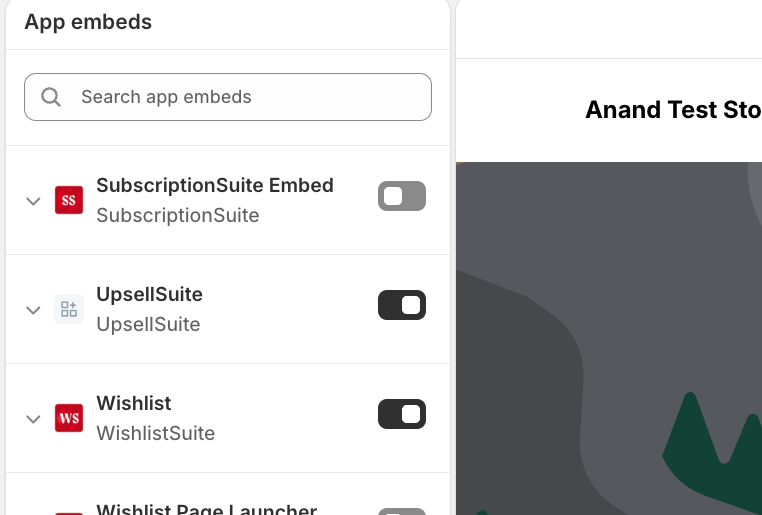

# Installation Guide

### 1. Install the app

Install UpsellSuite from the Shopify App Store (or your installation link) onto your store. You'll be redirected to the UpsellSuite Dashboard once installation completes.

### 2. Enable the App Embed

UpsellSuite's storefront offers render through a **theme app embed**, which must be turned on once per theme:

1. From the Dashboard's **Getting started** checklist, click **Enable App Embed**.
2. This opens your Theme Editor with the UpsellSuite app embed panel.
3. Toggle the embed **on**, then click **Save** in the Theme Editor.
4. Return to the UpsellSuite tab — your Dashboard's **Setup status** will automatically update to show **App embed: Enabled** within moments, with no page refresh needed.


If you switch to a different theme later (or publish a new one), you'll need to enable the app embed on that theme too — embed status is tracked per theme.


### 3. Create your first offer

Use **Create offer** from the Dashboard to launch the Offer Builder. See [Offer Builder](../app-overview/offer-builder/) for a walkthrough of each offer type.

### 4. Publish

Once your offer is configured, publish it from the wizard's final step. Published offers go live on your storefront immediately — no theme deploy required.

### Setup status checklist

The Dashboard's **Setup status** card tracks four things:

* **App embed** — enabled via the Theme Editor (step 2 above)
* **Product page** — at least one active Product Page offer
* **Cart page** — at least one active Cart Page offer
* **Post-purchase** — at least one active Post-purchase offer

You don't need every row checked to start selling — this is a progress guide, not a requirement.
